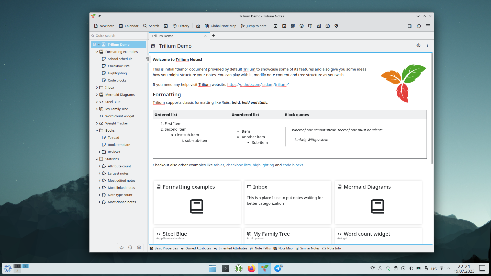
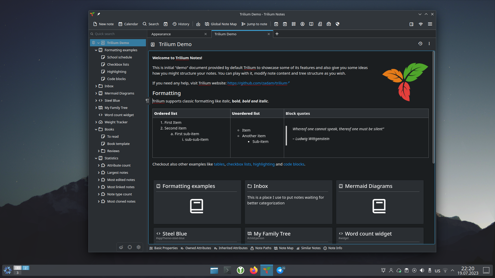

# KDE Breeze theme for Trilium Notes

Custom theme for Trilium Notes designed to match closely KDE's default theme, KDE Breeze.

The theme comes with both a light and a dark style, switching automatically based on the desktop preference.

## Screenshots

## Notable highlights

* The toolbar, which is normally on the left has been relocated to the top side to match more the KDE style. Some of the icons have been labelled.
* The note tabs/ribbon has been moved from the top of the note to the bottom. This matches closely the design of the Kate editor.

## Limitations

* For the desktop application, the theme requires the native title bar to be enabled. Otherwise, the application will be more difficult to use.
* The theme is still in beta, although it has been in use for quite some time. Feel free to report any issues in the [Issue](https://github.com/eliandoran/breeze-trilium/issues) section.

## Installation

1. Go to the releases section and download the latest release: [Breeze.zip](https://github.com/eliandoran/breeze-trilium/releases/download/v0.6.0/Breeze.zip).
2. In Trilium Notes, create a note anywhere called "Themes".
3. Simply drag & drop the `Breeze.zip` file onto the "Themes" note in the note tree.
4. Go to Menu -> Options -> Appearance and:
    * Look for the "Native title bar" option and set it to "enabled".
    * In the "Theme" section, select the "Breeze" theme.
5. Restart the application to apply the changes.
